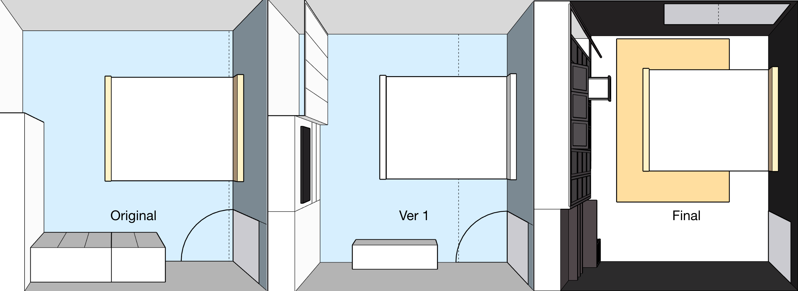
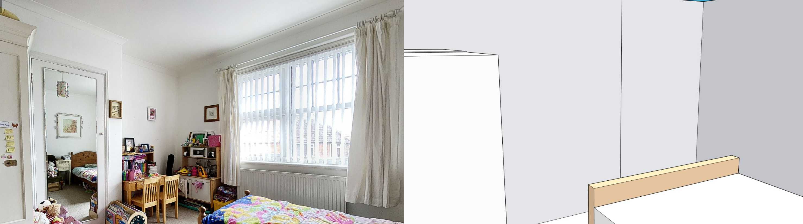
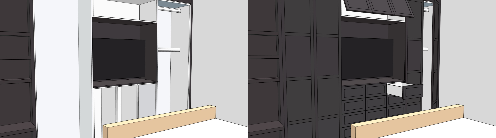
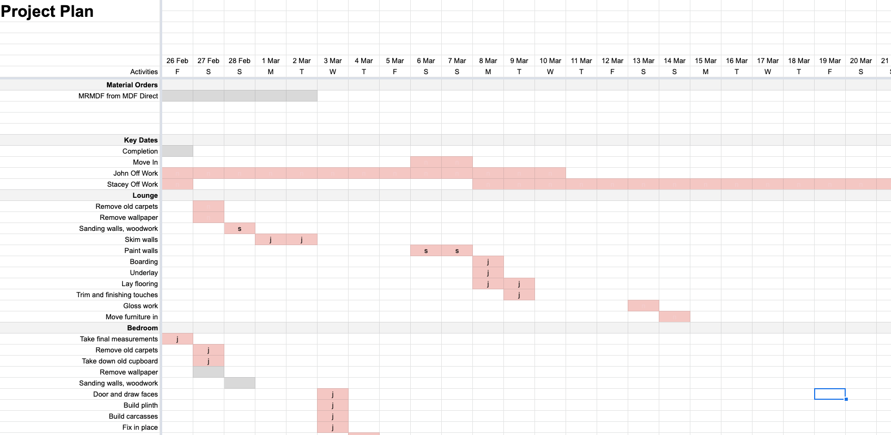

After finally securing a completion date after many delays we revisited our plans for renovation and, as the delays have meant we've built up more savings, we decided on something slightly more ambitious. We had originally intended to only redecorate the living room, but upon planning the layout of the furniture in our bedroom we realised that our wardrobes and drawers would be wasting a lot of space. 

I put forward a couple of options but after some discussion Stacey and I agreed that a built-in wardrobe unit would be the best use of space.

## The Brief
As we're our own clients, the brief was simple:

* This is a fitted unit, with Shaker-style panel doors
* The wardrobe and storage space needs to be equivalent to what we have now
* The doors and draws should feature push-to-open fittings
* There should be a space for a 47-inch television

## The Process
I'm no stranger to DIY, but I've never built anything this complex before - I needed help. I turned to YouTube to gather tips about building cabinets with MDF and stumbled upon an utter goldmine. [Peter Millard's Ten Minute Workshop](https://www.youtube.com/user/petermillard1) series has more than 400 videos relating to the topic of cabinetry, including very specific tips about working with MDF. 

After plotting a basic design on paper, I brought the designs to life using the Sketchup model of the house that I'd put together previously. 

### The Design
There is currently a small built-in cupboard that is inset in a stud wall that extends from the chimney stack. We will start by tearing this down to clear an area for the wardrobe. 

Using millimetre measurements taken during a site visit, I have prepared an accurate 3D plan of the bedroom using SketchUp. Based on our current wardrobes and things learned during the research, I created a wardrobe design that will provide us with the space that we need to store all of our belongings without the need for any additional wardrobe space.

The design inludes:

* 18mm thick Carcasses for the wardrobes, drawers and cupboard spaces
* 4 large panel doors; initially 12mm panel and 6mm stiles and rails - but I later increased the panel to an 18mm panel as recommended by my research
* 15 drawers 
* A centre console for a television
* A top-hinged cupboard to store sheets and blankets

### Costing the work
After each iteration was complete, I amended the cut list in the Bedroom 1 sheet of my [project plan spreadsheet](https://docs.google.com/spreadsheets/d/1ZqwMiu7t8e7Rz4fYyR5V3RgFjRt0eDlrKWRQ-o2yMH8/edit?usp=sharing). I was then able to search for suppliers (such as MDFDirect) and adjust the costs of the cutlist accordingly. 

As I do not own or have sufficient workshop space to handle long MDF panel cuts, I have decided to use MDF Direct's pre-cut panels option. As the price increases with each individual panel, I made sure to consolidate the cut list so that I didn't blow the budget on panels that I could cut to size myself. All the draw fascias will be cut from larger panels. I've made sure to over-order these to ensure there's enough of a margin to account for the width of my saw blades. 

## The Delivery Plan
Once the final(ish) plan was in place, I created a plan for the man-hours the work would take in the same [Google sheet](https://docs.google.com/spreadsheets/d/1ZqwMiu7t8e7Rz4fYyR5V3RgFjRt0eDlrKWRQ-o2yMH8/edit?usp=sharing). 

This enables me to keep track as we progress through the project, while enabling me to plan deliveries and (using the estimated delivery lead times) order cut-off dates for crucial supplies. Even though the MDF and fibreboard are moisture resistant, they can warp out of shape if stored incorrectly - I'm hoping I only need to store them for a couple of days maximum. 

## Next Steps
We're 18 days out and the materials are on the way. 

Further updates to come. 